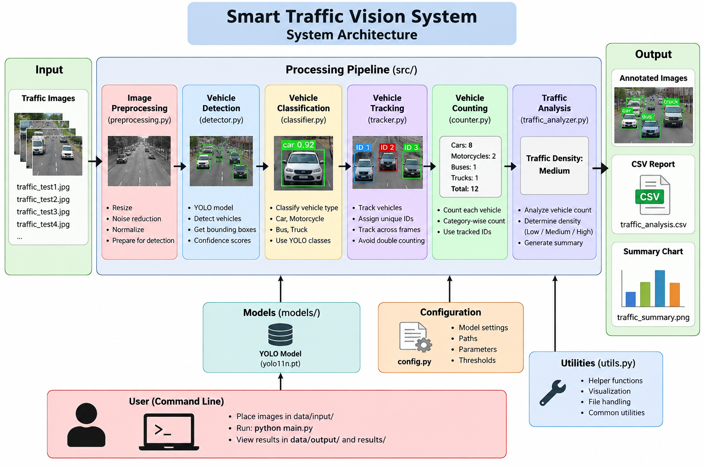
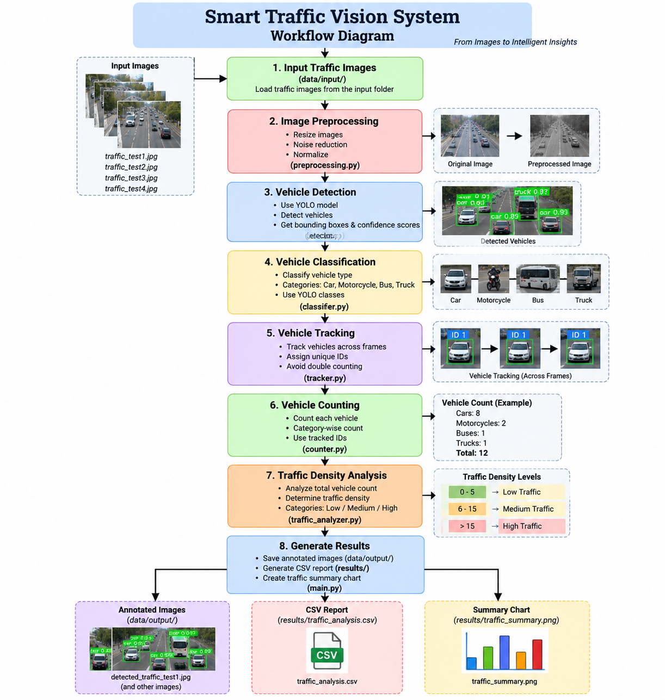

# Smart Traffic Vision System

## Overview

Smart Traffic Vision System is a computer vision-based application that analyzes traffic images and detects vehicles automatically. The system processes input traffic images, detects vehicles, classifies them into different categories, counts the vehicles, tracks detected vehicles, and analyzes the overall traffic density.

The system provides annotated output images, a CSV report containing traffic analysis results, and a traffic summary visualization.

## Features

- Traffic image preprocessing
- Vehicle detection using YOLO11n
- Vehicle classification
- Vehicle counting
- Vehicle tracking
- Traffic density analysis
- Annotated traffic images
- CSV-based traffic analysis report
- Traffic summary visualization
- Automated testing using Pytest

## Vehicle Categories

The system identifies the following vehicle categories:

- Cars
- Motorcycles
- Buses
- Trucks

## Technologies Used

- Python 3.11
- OpenCV
- Ultralytics YOLO11n
- NumPy
- Pandas
- Scikit-learn
- Matplotlib
- PyYAML
- Pytest

## Project Structure

```text
SMART-TRAFFIC-VISION-SYSTEM/
│
├── data/
│   ├── input/
│   │   ├── traffic_test1.jpg
│   │   ├── traffic_test2.jpg
│   │   ├── traffic_test3.jpg
│   │   └── traffic_test4.jpg
│   │
│   └── output/
│       ├── processed traffic images
│       └── detected traffic images
│
├── diagrams/
│   ├── architecture.png
│   └── workflow.png
│
├── models/
│
├── results/
│   ├── traffic_analysis.csv
│   └── traffic_summary.png
│
├── src/
│   ├── __init__.py
│   ├── preprocessing.py
│   ├── detector.py
│   ├── classifier.py
│   ├── counter.py
│   ├── tracker.py
│   ├── traffic_analyzer.py
│   └── utils.py
│
├── tests/
│   ├── test_preprocessing.py
│   ├── test_detector.py
│   ├── test_classifier.py
│   ├── test_counter.py
│   ├── test_tracker.py
│   └── test_traffic_analyzer.py
│
├── config.py
├── main.py
├── requirements.txt
├── statement.md
└── README.md
```

## System Architecture

The architecture of the Smart Traffic Vision System is shown below:



## Project Workflow

The workflow of the Smart Traffic Vision System is shown below:



## Installation and Setup

### 1. Clone the Repository

```bash
git clone https://github.com/arrrhamjain/SMART-TRAFFIC-VISION-SYSTEM.git
cd SMART-TRAFFIC-VISION-SYSTEM
```

### 2. Create a Virtual Environment

Python 3.11 is recommended for this project.

On Windows:

```bash
py -3.11 -m venv venv
```

Activate the virtual environment:

```bash
venv\Scripts\activate
```

On Linux/macOS:

```bash
python3.11 -m venv venv
source venv/bin/activate
```

### 3. Install Dependencies

Install all required Python packages using:

```bash
pip install -r requirements.txt
```

## YOLO11n Model

The project uses the YOLO11n model for vehicle detection.

If the YOLO11n model file is not available locally, Ultralytics automatically downloads the required model when the project is run for the first time.

Therefore, the model file does not need to be manually downloaded before running the project.

## Input Data

Sample traffic images are provided in:

```text
data/input/
```

The sample input files are:

```text
traffic_test1.jpg
traffic_test2.jpg
traffic_test3.jpg
traffic_test4.jpg
```

Additional traffic images can also be placed inside the `data/input/` directory.

## Running the Project

After activating the virtual environment and installing the dependencies, run:

```bash
python main.py
```

The program processes the traffic images from the input directory and performs:

1. Image preprocessing
2. Vehicle detection
3. Vehicle classification
4. Vehicle counting
5. Vehicle tracking
6. Traffic density analysis
7. Output generation

## Output

After execution, the processed results are generated in the following directories.

### Annotated Images

```text
data/output/
```

The output images contain detected vehicles and their annotations.

### Traffic Analysis Report

```text
results/traffic_analysis.csv
```

The CSV file contains the traffic analysis results, including the number of detected vehicles and traffic density.

### Traffic Summary Visualization

```text
results/traffic_summary.png
```

This image provides a visual summary of the traffic analysis results.

## Traffic Density Classification

The system classifies traffic density based on the number of detected vehicles.

The output categories are:

- Low
- Medium
- High

## Testing

The project includes automated tests using Pytest.

To run all tests:

```bash
python -m pytest tests -v
```

The test suite covers:

- Image preprocessing
- Vehicle detection
- Vehicle classification
- Vehicle counting
- Vehicle tracking
- Traffic density analysis

The project was tested successfully with all 9 tests passing.

## Sample Results

The system was tested using four sample traffic images.

| Input Image | Detected Vehicles | Traffic Density |
|-------------|-------------------|-----------------|
| traffic_test1.jpg | 1 | Low |
| traffic_test2.jpg | 12 | Medium |
| traffic_test3.jpg | 12 | Medium |
| traffic_test4.jpg | 16 | Medium |

## Command-Line Execution

The complete project can be executed from the command line using:

```bash
python main.py
```

Testing can be performed using:

```bash
python -m pytest tests -v
```

No GUI setup is required to run the project.

## Model Selection

YOLO11n was selected for vehicle detection because it provides an efficient object detection approach suitable for a lightweight computer vision project. It allows the system to detect multiple vehicles in traffic images while maintaining a practical balance between detection capability and computational requirements.

## Project Scope

The project focuses on traffic analysis from images. It demonstrates vehicle detection, classification, counting, tracking, and traffic-density analysis using computer vision techniques.

The current implementation is image-based and can be extended to real-time traffic video processing in future versions.

## Future Enhancements

Possible future improvements include:

- Real-time traffic video processing
- Advanced multi-object tracking
- Real-time traffic monitoring dashboard
- Additional vehicle categories
- Automatic traffic alerts
- Improved detection accuracy
- Database integration
- Cloud or edge deployment

## License

# Smart Traffic Vision System

## Overview

Smart Traffic Vision System is a computer vision-based application that analyzes traffic images and detects vehicles automatically. The system processes input traffic images, detects vehicles, classifies them into different categories, counts the vehicles, tracks detected vehicles, and analyzes the overall traffic density.

The system provides annotated output images, a CSV report containing traffic analysis results, and a traffic summary visualization.

## Features

- Traffic image preprocessing
- Vehicle detection using YOLO11n
- Vehicle classification
- Vehicle counting
- Vehicle tracking
- Traffic density analysis
- Annotated traffic images
- CSV-based traffic analysis report
- Traffic summary visualization
- Automated testing using Pytest

## Vehicle Categories

The system identifies the following vehicle categories:

- Cars
- Motorcycles
- Buses
- Trucks

## Technologies Used

- Python 3.11
- OpenCV
- Ultralytics YOLO11n
- NumPy
- Pandas
- Scikit-learn
- Matplotlib
- PyYAML
- Pytest

## Project Structure

```text
SMART-TRAFFIC-VISION-SYSTEM/
│
├── data/
│   ├── input/
│   │   ├── traffic_test1.jpg
│   │   ├── traffic_test2.jpg
│   │   ├── traffic_test3.jpg
│   │   └── traffic_test4.jpg
│   │
│   └── output/
│       ├── processed traffic images
│       └── detected traffic images
│
├── diagrams/
│   ├── architecture.png
│   └── workflow.png
│
├── models/
│
├── results/
│   ├── traffic_analysis.csv
│   └── traffic_summary.png
│
├── src/
│   ├── __init__.py
│   ├── preprocessing.py
│   ├── detector.py
│   ├── classifier.py
│   ├── counter.py
│   ├── tracker.py
│   ├── traffic_analyzer.py
│   └── utils.py
│
├── tests/
│   ├── test_preprocessing.py
│   ├── test_detector.py
│   ├── test_classifier.py
│   ├── test_counter.py
│   ├── test_tracker.py
│   └── test_traffic_analyzer.py
│
├── config.py
├── main.py
├── requirements.txt
├── statement.md
└── README.md
```

## System Architecture

The architecture of the Smart Traffic Vision System is shown below:


## Project Workflow

The workflow of the Smart Traffic Vision System is shown below:


## Installation and Setup

### 1. Clone the Repository

```bash
git clone https://github.com/arrrhamjain/SMART-TRAFFIC-VISION-SYSTEM.git
cd SMART-TRAFFIC-VISION-SYSTEM
```

### 2. Create a Virtual Environment

Python 3.11 is recommended for this project.

On Windows:

```bash
py -3.11 -m venv venv
```

Activate the virtual environment:

```bash
venv\Scripts\activate
```

On Linux/macOS:

```bash
python3.11 -m venv venv
source venv/bin/activate
```

### 3. Install Dependencies

Install all required Python packages using:

```bash
pip install -r requirements.txt
```

## YOLO11n Model

The project uses the YOLO11n model for vehicle detection.

If the YOLO11n model file is not available locally, Ultralytics automatically downloads the required model when the project is run for the first time.

Therefore, the model file does not need to be manually downloaded before running the project.

## Input Data

Sample traffic images are provided in:

```text
data/input/
```

The sample input files are:

```text
traffic_test1.jpg
traffic_test2.jpg
traffic_test3.jpg
traffic_test4.jpg
```

Additional traffic images can also be placed inside the `data/input/` directory.

## Running the Project

After activating the virtual environment and installing the dependencies, run:

```bash
python main.py
```

The program processes the traffic images from the input directory and performs:

1. Image preprocessing
2. Vehicle detection
3. Vehicle classification
4. Vehicle counting
5. Vehicle tracking
6. Traffic density analysis
7. Output generation

## Output

After execution, the processed results are generated in the following directories.

### Annotated Images

```text
data/output/
```

The output images contain detected vehicles and their annotations.

### Traffic Analysis Report

```text
results/traffic_analysis.csv
```

The CSV file contains the traffic analysis results, including the number of detected vehicles and traffic density.

### Traffic Summary Visualization

```text
results/traffic_summary.png
```

This image provides a visual summary of the traffic analysis results.

## Traffic Density Classification

The system classifies traffic density based on the number of detected vehicles.

The output categories are:

- Low
- Medium
- High

## Testing

The project includes automated tests using Pytest.

To run all tests:

```bash
python -m pytest tests -v
```

The test suite covers:

- Image preprocessing
- Vehicle detection
- Vehicle classification
- Vehicle counting
- Vehicle tracking
- Traffic density analysis

The project was tested successfully with all 9 tests passing.

## Sample Results

The system was tested using four sample traffic images.

| Input Image | Detected Vehicles | Traffic Density |
|-------------|-------------------|-----------------|
| traffic_test1.jpg | 1 | Low |
| traffic_test2.jpg | 12 | Medium |
| traffic_test3.jpg | 12 | Medium |
| traffic_test4.jpg | 16 | Medium |

## Command-Line Execution

The complete project can be executed from the command line using:

```bash
python main.py
```

Testing can be performed using:

```bash
python -m pytest tests -v
```

No GUI setup is required to run the project.

## Model Selection

YOLO11n was selected for vehicle detection because it provides an efficient object detection approach suitable for a lightweight computer vision project. It allows the system to detect multiple vehicles in traffic images while maintaining a practical balance between detection capability and computational requirements.

## Project Scope

The project focuses on traffic analysis from images. It demonstrates vehicle detection, classification, counting, tracking, and traffic-density analysis using computer vision techniques.

The current implementation is image-based and can be extended to real-time traffic video processing in future versions.

## Future Enhancements

Possible future improvements include:

- Real-time traffic video processing
- Advanced multi-object tracking
- Real-time traffic monitoring dashboard
- Additional vehicle categories
- Automatic traffic alerts
- Improved detection accuracy
- Database integration
- Cloud or edge deployment

## License

This project is developed for academic and educational purposes as part of the Computer Vision course project at VIT Bhopal University.